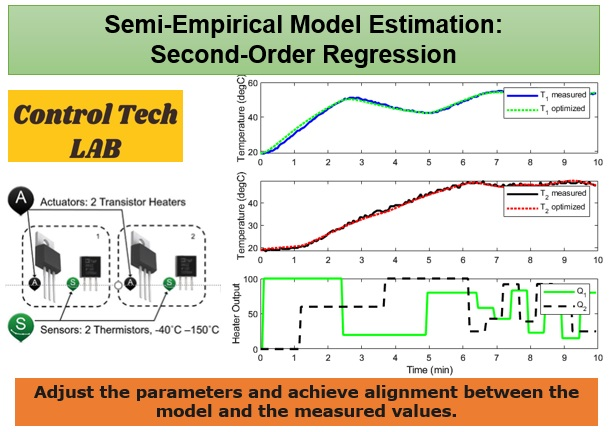

# Intelligent Control Systems by Asst. Prof. Dr. Claudia F. Yaşar

This repository contains the curriculum materials used for the Intelligent Control Systems course YTU Department of Control and Automation Engineering.

# Semi-Empirical-Model-Estimation-Regression
This work focuses on semi-empirical model estimation using second-order regression for system identification. An optimizer adjusts parameters to align predictions with measured values by minimizing errors. The goal is to fit predictions to TC Lab's two-heater model data, minimizing the integral absolute error (IAE). Using a 10-minute data collection period with rapid and slow asynchronous (staggered) steps of the heaters with varying magnitudes and directions, the optimizer refines parameters to match model outputs with real-time data.

# Acknowledgements
I would like to express my gratitude to the students of the Intelligent Control Systems course of the YTÜ Control and Automation Engineering department, Class 2022 and 2023, whose dedication and hard work made this project possible. I am also deeply thankful to our Control Tech LAB team, Doctors Marco Rossi, and Melda Ulusoy for their invaluable contributions.

